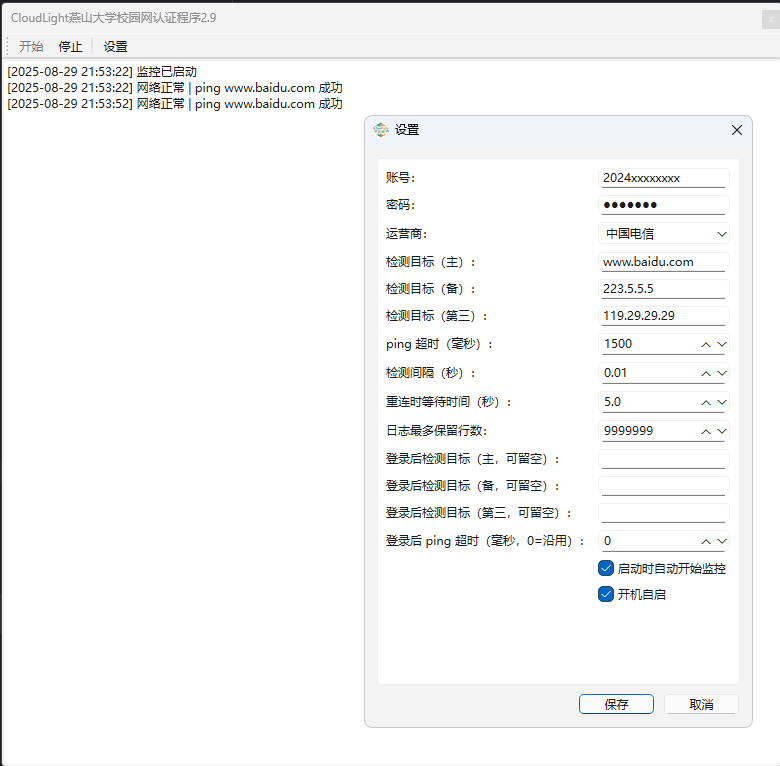

# 燕山大学校园网自动认证工具

**燕山大学校园网自动认证工具** —— 托盘常驻，掉线自动重连，带可视化日志界面与设置界面。

## ✨ 功能特性
- 🔌 自动检测网络，每隔一段时间检测是否在线，掉线时自动认证。
- 🖥️ 托盘常驻（不显示在任务栏），右上角关闭按钮只会最小化到托盘。
- 📋 可视化界面：查看实时日志，操作 **开始 / 停止 / 设置**。
- ⚙️ 设置界面可修改：
  - 账号、密码、运营商
  - 检测间隔（秒）
  - ping的服务器
  - `ping` 超时（毫秒）
  - 是否启动时自动开始监控
  - 是否开机自启
- 🖱️ 托盘右键菜单：**开始 / 停止 / 设置 / 退出程序**
- 💾 配置保存到 `%APPDATA%\NetAutoAuth\config.json`

## 📦 使用方法
1. 双击运行 `CloudLight校园网认证程序x.x.exe`  
   - 程序不会显示在任务栏，只在右下角托盘区域常驻。
2. **单击托盘图标**：显示/隐藏日志窗口。
3. **右键托盘图标**：快速操作（开始 / 停止 / 设置 / 退出）。
4. **设置**：可修改账号、网络检测配置等，点击保存即生效。

## ⚙️ 配置文件
配置文件路径：
%APPDATA%\NetAutoAuth\config.json

# 🚫🚫🚫破解校园网相关🚫🚫🚫
- 另外，对于一些同学的破解校园网的需求，我有一个思路，但是我本人十分反对并谴责这种行为，所以仅在此简要说明。
- 简要来说，就是可以通过封装每一个本地的包为53号端口的DNS解析包，从53号端口发出到你的云服务器（或者某个校外的电脑，但是没有公网IP会麻烦一些），然后云服务器解包出来原数据包后转发给需要送达的主机。然后云服务器收到主机返回的包后封装为DNS解析包，通过53号端口发到校园网内你的电脑，然后在你的电脑解包。
- 可以直接查询“DNS隧道”技术，网上其实有很成熟的方案。
- 因为校园网与外网的53号端口是一直开放的，无论你有没有认证！所以只要把数据封装为53号包就可以绕过认证系统！
- 不信的话，大家可以在没有网的情况下ping www.baidu.com 或者 www.bilibili.com 等任何网站，均会出现正在ping IP（例如456.789.321.147）的输出，虽然全部丢包，但是这说明在没有认证的情况下可以连接到DNS服务器。
## 为什么会这样？
- 因为校园网为了让你能访问认证页面，必须先允许你的DNS查询，否则你连认证页面的域名都无法解析！
## 可能的技术问题？
- 可能有人会觉得这需要CPU开销，实则不然，你每天发无数的网络包根本都几乎不占用任何资源，添加一个封包解包操作几乎是没有影响的。
- 另外，延迟也不会增高多少，如果你的云服务器在上海杭州等地，甚至可以当作一个加速器用。不过由于我们学校在秦皇岛，更建议在距离较近的北京租用云服务器，我估计如果在北京租用云服务器，可能延迟比正常上网会高20ms左右。
- 不过带宽可能取决于你的云服务器，或者你的云服务器带宽足够大的话可以搜索一下"如何改善DNS隧道的带宽”
- 本人没有云服务器并且没有破解需求，更重要的是本人强烈反对这种行为，所以仅提供简要思路。
